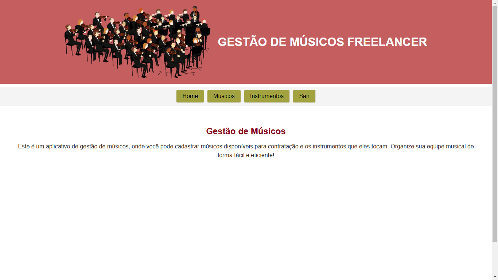
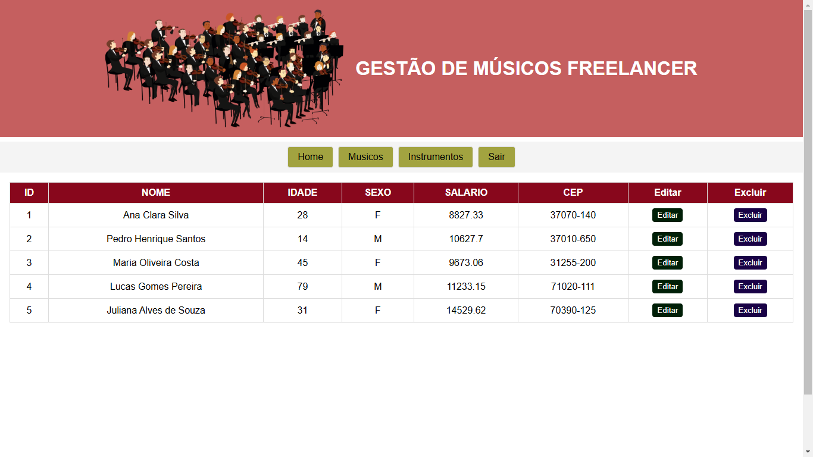

# Gestão de Músicos

- **Autor:** Paulo Palmuti Sigiani Neto
- **Objetivo:** Este é um aplicativo de gestão de músicos, onde você pode visualizar músicos disponíveis para contratação e os instrumentos que eles tocam. Organize sua equipe musical de forma fácil e eficiente!

## Features

Nesse projeto consegui implementar o módulo 2 do curso: A visualização e a deleção de musicos e instrumentos musicais. É possível navegar pelas categorais (músicos ou instrumentos) através do menu da página.

## Tecnologias utilizadas

Foram utilizados React, Axios e o pacote Json-Server.

## Dependencias utilizadas

- axios 1.7.7
- react 18.3.1
- react-dom 18.3.1
- json-server 1.0.0-beta.3

## **Instruções de Execução:**

Basta baixa o projeto, rodar os comandos no terminal do linux:

`npm install`
`npm install json-server `

Em um terminal rodar:

`json-server modelo.json --port=3333 `

E em outro:

`npm run dev`

## **Screenshots ou Demonstração**

Pagina **HOME:**

Pagina **MUSICOS**

## **Considerações Finais:**

Os desafios foram grandes, e apesar de não ter conseguido concluir o projeto, foi uma boa introdução ao mundo do React e do front end. Deixo meus agradecimentos ao experiente professor Liniquer pelas aulas.